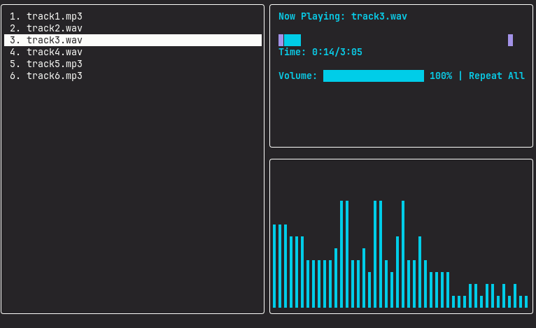

# Audio++
**Audio++** is a minimal, terminal-based audio player written in modern C++ with a primary focus on a lightweight design and direct interaction.

<br>
It's primarily made for Linux systems, but also support Windows (RECOMMENDED: Terminal.exe). It should also work on macOS, though it hasn't been tested.

# Installing and building from source

## Clone the repo
Inside your terminal, run `git clone --recurse https://github.com/H3X-FF/audiopp.git`

---

**IMPORTANT:** make sure you actually pass `--recurse` to clone its submodules with it.

---
## Building the project
Inside the audiopp directory, run the following:
```
cmake -S . -B build
cmake --build build
```

---

## Run it
Inside your build directory, you can now run it<br>
`./audiopp`

---

# How to use
You can always press 'h' to see existing keybinds and commands

## Keybinds:

**Up/Down arrow keys** for navigation

**Enter** start currently selected track

**Space** pause/unpause

**,** seek backwards

**.** seek forward

**[** lower volume

**]** raise volume

**f** go to active track

**l** change repeat mode

**:** for command mode

---

## Commands
**scan [DIR]** Scans the specified directory and adds audio files<br>
options: --recurse

**rm [filename/index]** Removes a track either by writing the track's name or its number on the list (e.g. rm 5)
You can also remove a range of tracks (e.g. rm 1-5)

**rename [filename/index]** Changes the name of a track (NOTE: This only changes the track's name in the application, not the actual filename stored in disk)

**sort [type]** Sorts the file list.<br>
Types: name, size, lwt(last write time), ext[ension]<br>
Options: --normal (default/implicit) --reverse

---

## Current features
- Minimal and lightweight design
- Simple keyboard controls
- Virtual filesystem
- small set of commands
- Smooth audio playback
- Audio controls

## Planned features
- Playlist support
- Queues
- Customization/Theming
- Improved metadata handling
- Improved Library handling
